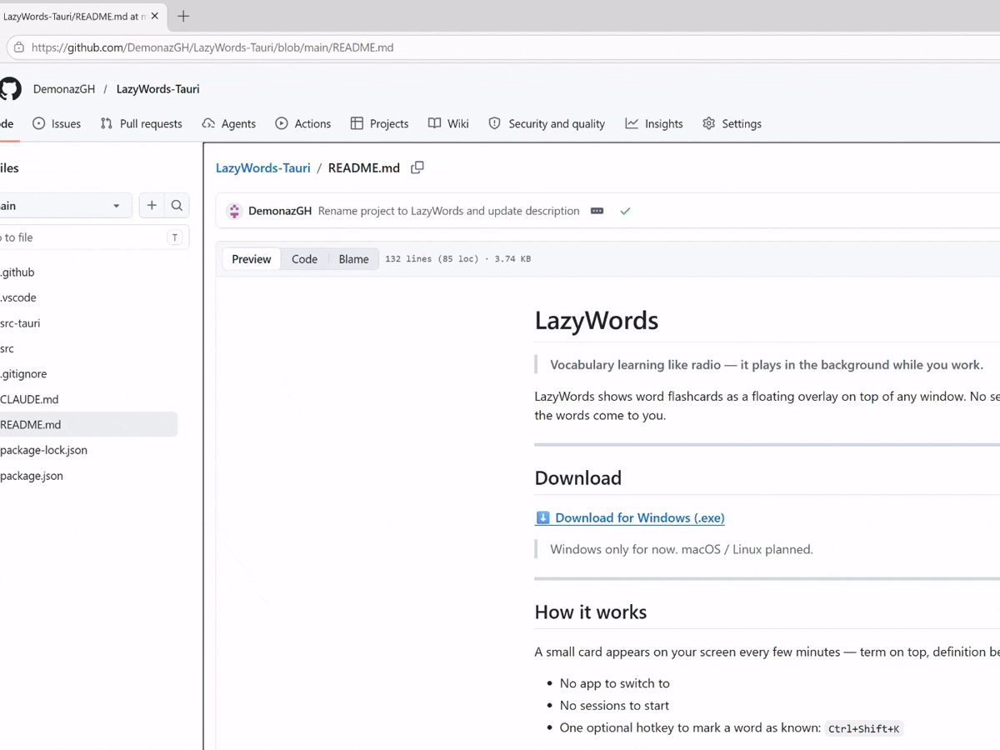

# LazyWords

> **Vocabulary learning like radio — it plays in the background while you work.**

LazyWords shows word flashcards as a floating overlay on top of any window. No sessions, no drilling, no app switching. Just keep working — the words come to you.



---

## Download

**[⬇ Download for Windows (.exe)](https://github.com/DemonazGH/LazyWords-Tauri/releases/latest)**

> Windows only for now. macOS / Linux planned.

---

## How it works

A small card appears on your screen every few minutes — term on top, definition below. You glance at it, it fades away. That's it.

- No app to switch to
- No sessions to start
- One optional hotkey to mark a word as known: `Ctrl+Shift+K`

Over days and weeks, unfamiliar words become familiar. Passively.

---

## Features

| | |
|---|---|
| 🪟 **Always on top** | Cards float over any app — browser, editor, terminal |
| 🔇 **Zero interaction required** | Cards appear and disappear on their own |
| 📚 **4 built-in dictionaries** | EN→RU, English definitions, irregular verbs, or import your own |
| 🖥️ **Multi-monitor** | Card always appears on the monitor you're working on |
| 🚫 **Fullscreen detection** | Cards are suppressed during games, videos, presentations |
| ⚙️ **Autostart** | Launches silently with Windows |
| 📊 **Statistics** | Daily streak and words learned over time |

---

## Hotkeys

| Hotkey | Action |
|--------|--------|
| `Ctrl+Shift+K` | Mark current word as known |
| `Ctrl+Shift+N` | Show next card immediately |
| `Ctrl+Shift+P` | Pause / resume |
| `Ctrl+Shift+W` | Open settings |

---

## Dictionaries

LazyWords ships with three starter packs from the [NGSL 1.2](http://www.newgeneralservicelist.org/) wordlist (~2800 most useful English words):

- **EN → RU** — English words with Russian translations
- **English definitions** — English words with short English definitions
- **Irregular verbs** — ~200 verbs with base / past / past participle forms

You can also **import your own** CSV, JSON, or XLSX file. Use `term` and `definition` as column names (or `word`/`translation`, `front`/`back` — all accepted).

---

## Settings

Open with `Ctrl+Shift+W` or via the system tray icon.

- Switch active dictionary
- Adjust card interval, font size, and position
- Enable/disable autostart
- View learning statistics
- Import custom dictionaries

---

## Import your own content

LazyWords works for any flashcard content, not just vocabulary. Create a CSV:

```csv
term,definition
Photosynthesis,Process by which plants convert sunlight into energy
Mitosis,Cell division producing two identical daughter cells
```

Supported formats: `.csv` · `.json` · `.xlsx`

Column name aliases accepted: `word/translation`, `front/back`, or just the first two columns.

---

## Building from source

**Prerequisites:** [Rust](https://rustup.rs/) · [Node.js](https://nodejs.org/)

```bash
git clone https://github.com/DemonazGH/LazyWords-Tauri.git
cd LazyWords-Tauri
npm install
npm run tauri dev       # development with hot-reload
npm run tauri build     # production .msi / .exe installer
```

Run tests:

```bash
cd src-tauri && cargo test
```

27 unit tests across dictionary loading, word engine, stats, i18n, and settings.

---

## Tech stack

- [Tauri v2](https://tauri.app/) — Rust backend + system WebView
- Vanilla JS / HTML / CSS — no frontend build step
- Tokio async runtime — timer loop and IPC
- GitHub Actions — automated Windows installer builds on every release tag

---

## License

MIT — see [LICENSE](LICENSE)

Dictionary data from [NGSL 1.2](http://www.newgeneralservicelist.org/) — Creative Commons BY 4.0
